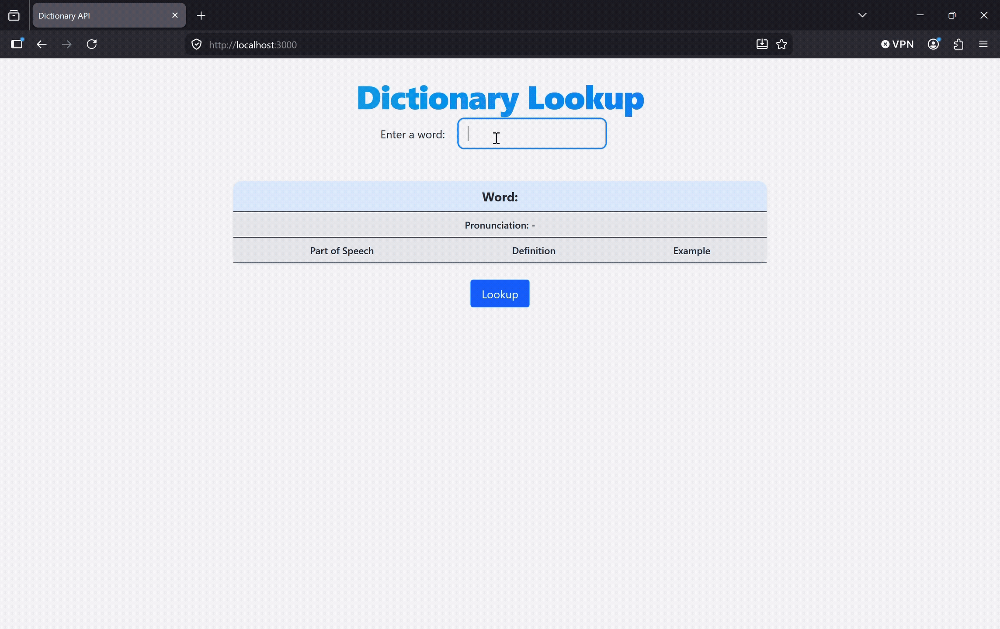
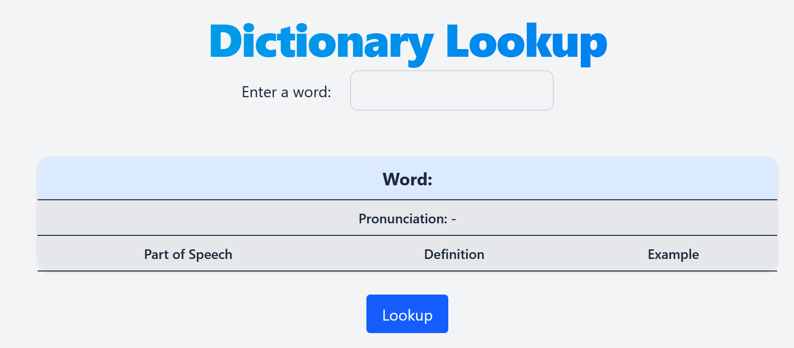
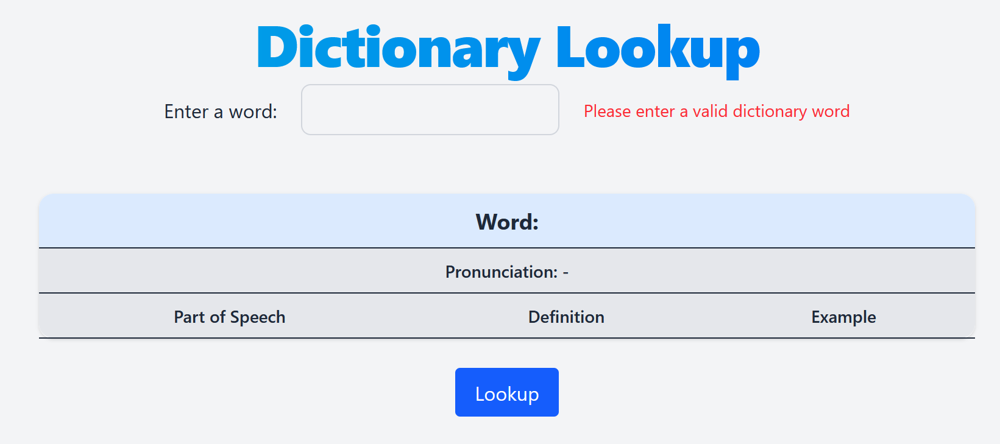
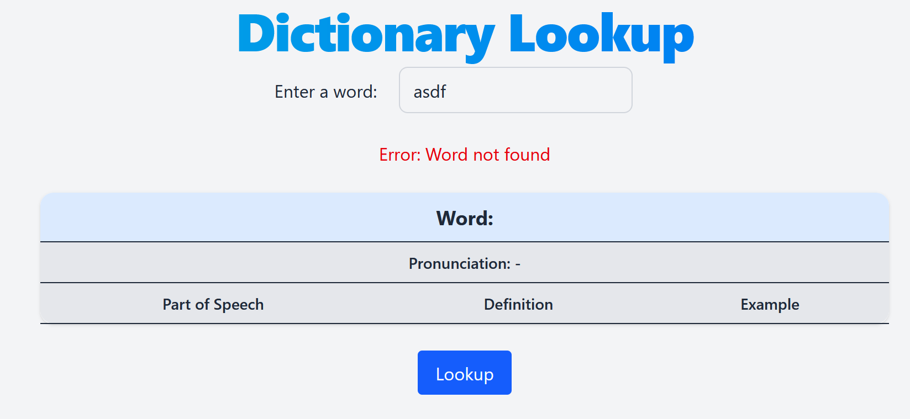

# 📘 Dictionary API

 

---

## 👤 Author
Ben Stearns - [@bstearns07](https://github.com/bstearns07)

📅 Last Updated: 4/25/2026

---

## 📑 Table of Contents
- 📌 [Summary](#-summary)
- ⭐ [How It Works](#-how-it-works)
- ✨ [Features](#-features)
- 🧰 [Tech Stack](#-tech-stack)
- 🔧 [Development Tools](#-development-tools)
- 🧩 [Core Concepts](#-core-concepts)
- 📝 [New Topics Covered](#-new-topics-covered)
- 📘 [What I Learned](#-what-i-learned)
- 🖼 [Screenshots](#-screenshots)

---

## 📌 Summary

Too lazy to open up the old Webster to look something up? Then this app might just come in handy. The
**Dictionary API** will look it up for you. Featuring an HTML and JavaScript frontend and a JavaScript Express API
server listening on the backend to serve everything up, just type the word you want to look up to read all about 
it. How does it do that? Courtesy of the good old [Free Dictionary API](https://dictionaryapi.dev/?ref=freepublicapis.com).
Feel free to check it out.

For full program details, refer to [Program Requirements](./assets/AssignmentInstructions.pdf)

---

## ⭐ How It Works
Follow the steps below to run the application locally.

### 🚀 Start the Server
1. Run `server.js` using your IDE's Run button or running the "node server" command from your IDE's terminal
2. Open your browser and navigate to: http://localhost:3000

### 🔎 Submit a Word
1. Enter the word you want to search for in the input field.
2. Click **Lookup** or press **Enter** to submit your search.

### 📊 View Results
1. If the word is not found or an error occurs, an error message will be displayed.
2. If the word is found, its details will appear in a results table below.
3. If pronunciation audio is available, click the **▶ Play** button to listen.

---

## 🚀 Live Demo
> ⬇️ **Click the link below to open the app in your browser and try it yourself!**⬇️

👉 

---

## ✨ Features
- Free Dictionary API for data retrieval
- Table layout for word information (part of speech, pronunciation, definitions, and example sentences)
- Data validation for user entry and no words found
- Enter key support for word submission
- Play button for word pronunciation if an audio file is available
- Tailwind CSS

---

## 🧰 Tech Stack

### 🖥 Frontend
- HTML5 (Semantic Markup)
- CSS3 (Layout & Styling)
- Vanilla JavaScript (ES6+)

### 🖥 Backend
- Node Express API server
- [Free Dictionary API](https://dictionaryapi.dev/?ref=freepublicapis.com)

---

## 🔧 Development Tools
- Git & GitHub
- WebStorm
- Free Dictionary API

---

### 🧩 Core Concepts
- API requests
- API error handling
- API Data handling
- Node Express Web Applications
- Data Validation

---

## 📝 New Topics Covered
- Making API requests and parsing the responses into usable data
- Validating against errors that make occurs during API requests
- Providing default responses if certain data elements didn't return anything from the API
- Creating a node express server web app to serve the application and handle api requests
- Manipulating the DOM to append the information to the web page
- Creating and using Audio objects

---

## 📘 What I Learned
I've always found APIs really cool to work with and an essential skill to learn to work with for any developer. This was my first project using an API to retrieve data for a JavaScript program.  This involve using the fetch() function to send the request and properly parsing the information into usable JSON objects. I also learned how to develope a node express server to handle the API requests instead of doing so directly in main code. I've never worked with Audio objects in JavaScript either, so this was cool to do in order to make a mini audio player to play the sound file url returned. This was also my first time hosting an application on Render, so this was very interesting to learn about. All-in-all this was a very fun project that I enjoyed putting together.

---

## 🖼 Screenshots

### 🖼 Default State

### Successful Request

### Data Validation

---

⬆️ [Back to Top](#-dictionary-api)
